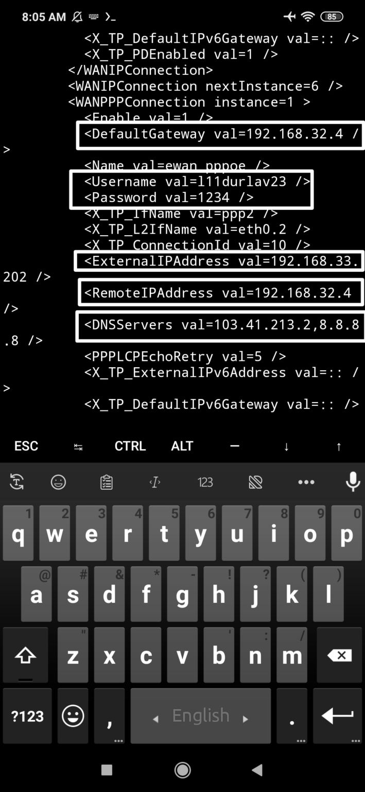

# conf.bin2 install now:

     pkg update && pkg upgrade -y
     
     pkg install git python -y
     
     pip3 install pycryptodome

    git clone https://github.com/princeicon2712/conf.bin2.git

    unzip 

    cd conf.bin2

## USE for exm:-

python tplink.py conf.xml 192.168.0.1
   
## rejaul by profile

<!--[profile](./confbin2.jpg)-->

